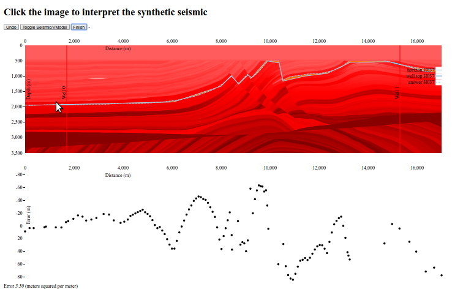

Interpret a synthetic seismic line so you can measure and improve your error.

Demo at [train-seismic-interp.wassname.com](http://train-seismic-interp.wassname.com/)

Seismic data source: "The Marmousi2 Model, Elastic Syntrain-seismic-interpthetic Data, and an Analysis of Imaging and AVO in a Structurally Complex Environment", Gary Martin, 2004, Thesis.
